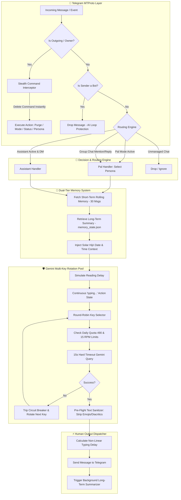

<div align="center">

# 👻 GhostGram PRO
### *Next-Gen Autonomous AI Telegram Userbot & Stealth Companion*

<p align="center">
  
  
  
  
  
  
  
</p>

<p align="center">
  <a href="#-core-features"><b>✨ Features</b></a> •
  <a href="#-stealth-command-matrix"><b>🎮 Commands</b></a> •
  <a href="#-dual-ai-modes--multi-persona-engine"><b>🎭 Personas</b></a> •
  <a href="#-human-like-simulation-engine"><b>⚡ Simulation</b></a> •
  <a href="#-dual-tier-memory-architecture"><b>🧠 Memory</b></a> •
  <a href="#-quick-start--installation"><b>🚀 Quick Start</b></a> •
  <a href="README_FA.md"><b>🇮🇷 نسخه فارسی (روح‌گرام)</b></a>
</p>

---

<p align="center">
  <b>GhostGram</b> is a production-grade, stealth, autonomous Telegram userbot that bridges your personal account directly with <b>Google Gemini AI</b>.<br/>
  It chats naturally in Persian or English, adopts dynamic swappable personalities, simulates realistic human reading & typing behavior, remembers long-term context, and executes self-destructing secret commands leaving zero trace.
</p>

---

</div>

<details>
<summary><b>📑 Table of Contents (Click to explore)</b></summary>

- [✨ Core Features](#-core-features)
- [🎮 Stealth Command Matrix](#-stealth-command-matrix)
- [🏗️ System Architecture](#️-system-architecture)
- [🎭 Dual AI Modes & Multi-Persona Engine](#-dual-ai-modes--multi-persona-engine)
  - [1. Pal Mode (Autonomous Alter-Ego)](#1-pal-mode-autonomous-alter-ego)
  - [2. Assistant Mode (24/7 Digital Secretary)](#2-assistant-mode-247-digital-secretary)
  - [3. Auto-Engage / Lurker Mode](#3-auto-engage--lurker-mode)
  - [4. Dynamic Persona Switching](#4-dynamic-persona-switching)
- [⚡ Human-Like Simulation Engine](#-human-like-simulation-engine)
- [🧬 Dual-Tier Memory Architecture](#-dual-tier-memory-architecture)
- [🛡️ Enterprise Gemini Engine & Key Pool](#️-enterprise-gemini-engine--key-pool)
- [🧹 Ghost Purge (Message Cleaner)](#-ghost-purge-message-cleaner)
- [🚀 Quick Start & Installation](#-quick-start--installation)
  - [Option A: 1-Click Interactive Setup Wizard (Windows)](#option-a-1-click-interactive-setup-wizard-windows)
  - [Option B: Manual / Local Installation](#option-b-manual--local-installation)
  - [Option C: Docker & Docker Compose](#option-c-docker--docker-compose)
  - [Option D: 1-Click 24/7 Linux VPS Deployment](#option-d-1-click-247-linux-vps-deployment)
- [⚙️ Configuration Reference (.env)](#️-configuration-reference-env)
- [🔒 Security & Zero-Leak Export](#-security--zero-leak-export)
- [📄 License & Disclaimer](#-license--disclaimer)

</details>

---

## ✨ Core Features

<table>
  <tr>
    <td width="50%">
      <h3>🕶️ Self-Destructing Stealth Codes</h3>
      <p>Control the bot from any chat using 3-digit secret codes (<code>777</code>, <code>000</code>, <code>666</code>, <code>444</code>, <code>999</code>) that <b>immediately auto-delete</b> upon delivery, leaving zero trace to other members.</p>
    </td>
    <td width="50%">
      <h3>🤖 Dual Core AI Operating Modes</h3>
      <p>Seamlessly toggle between <b>Pal Mode</b> (conversing informally in your tone/dialect) and <b>Assistant Mode</b> (acting as your polite 24/7 secretary for incoming private DMs).</p>
    </td>
  </tr>
  <tr>
    <td width="50%">
      <h3>🎭 Dynamic Multi-Persona Engine</h3>
      <p>Load unlimited custom personas from <code>personas/*.txt</code> files and swap them on the fly (<code>777 lust</code>, <code>777 sarcastic</code>, <code>777 poetic</code>, <code>777 angry</code>) without restarting.</p>
    </td>
    <td width="50%">
      <h3>🕵️ Autonomous Group Lurker (Auto-Engage)</h3>
      <p>Periodically analyzes group discussions in the background via structured JSON output and naturally chimes into interesting debates at randomized human intervals.</p>
    </td>
  </tr>
  <tr>
    <td width="50%">
      <h3>⚡ Ultra-Realistic Human Behavior</h3>
      <p>Calculates reading delays based on text length + simulates realistic non-linear typing speed (CPM/WPM) with active Telegram typing actions. Automatically strips robotic AI giveaways (emojis & formatting).</p>
    </td>
    <td width="50%">
      <h3>🧠 Dual-Tier Rolling Memory</h3>
      <p>Features a 30-message short-term rolling window with smart sentence-boundary truncation, plus an automatic background long-term memory compressor powered by Gemini.</p>
    </td>
  </tr>
  <tr>
    <td width="50%">
      <h3>🛡️ Enterprise Multi-Key Pool</h3>
      <p>Round-robin rotation across unlimited Gemini API keys, daily quotas (490/key buffer), 15 RPM throttling, 3-strike circuit breaker, and strict 15s timeout protection.</p>
    </td>
    <td width="50%">
      <h3>🧹 Ghost Purge (Message Cleaner)</h3>
      <p>Instantly batch-deletes all messages sent by you in any chat or supergroup with built-in Telegram FloodWait recovery and zero traces.</p>
    </td>
  </tr>
</table>

---

## 🎮 Stealth Command Matrix

> [!IMPORTANT]
> **Owner-Only Security**: All stealth codes are strictly restricted to your personal Telegram account (`event.out`). Any command you send **deletes itself immediately**, and a short confirmation is silently posted to your **Saved Messages** (auto-deleted after a few seconds).

| Code | Action |
|---|---|
| `777` / `777 <persona>` | Pal Mode ON (autonomous alter-ego in this chat) |
| `000` / `000 all` | Pal Mode OFF (this chat / all chats) |
| `777 engage [min]` | Auto-Engage lurker ON (default 20 min) |
| `777 engage off [all]` | Auto-Engage OFF |
| `666` | Assistant Mode ON (all DMs) |
| `444` / `444 all` or `444 کل` | Assistant OFF (this chat / all) |
| `!مسدود` (reply) | 🚫 **NEW — Blacklist a user**: the assistant will never reply to them again (ID also accepted: `!مسدود 123456`) |
| `!آزاد` (reply) | ✅ **NEW — Remove user from blacklist** |
| `222 [hours]` | 📋 Group catch-up summary (what you missed; default 12h, max 72h) |
| `112 <question>` | 🌐 Web search via Google Search grounding (longer timeout for grounded calls) |
| `555 <instruction>` | ⏰ Smart reminder: `555 ساعت 21 به علی بگو تماس بگیره` · `555 تا ۲ ساعت دیگه دارو بخور` |
| `333` | Reset short-term memory of this chat |
| `999 [n]` | Ghost Purge (delete your messages) |
| `111 [text]` | Smart custom reply (use while replying to a message) |
| `555` (bare) / `888` | Status report / Help |

### 👁️ Multimodal Understanding
When Pal or Assistant mode is active, the bot now **understands photos, voice notes, video notes and PDF/text documents** — not just text:
- Send a photo → it is analyzed by Gemini and answered naturally.
- Send a voice message → it is transcribed/understood by Gemini and answered in chat.
- Send a video note / video → it is watched and understood (up to ~18 MB).
- Send a PDF/text document → its content is read and understood.

*(reminders survive restarts — persisted in `reminders_state.json` inside your volume)*

### 🔔 Silent Feedback & Error Reporting
- Every stealth command is confirmed in your **Saved Messages** and auto-deleted — zero traces in the target chat.
- Engine/send failures are reported to **Saved Messages** so a headless Railway deployment never fails silently (disable with `NOTIFY_ERRORS=0`).

```
                  ┌─────────────────────────────────────────────────────────┐
                  │               GhostGram Stealth Trigger Map             │
                  └────────────────────────────┬────────────────────────────┘
                                               │
             ┌───────────────────┬─────────────┴─────┬───────────────────┐
             ▼                   ▼                   ▼                   ▼
      [ PAL ENGINE ]     [ AUTO-ENGAGE ]     [ ASSISTANT ]        [ UTILITIES ]
      • 777 (Normal)     • 777 engage        • 666 (All DMs)      • 111 (Smart Reply)
      • 777 <persona>    • 777 engage <min>  • 444 (Mute Chat)    • 333 (Reset Memory)
      • 000 (Off Chat)   • 777 engage off    • 444 all/کل (Off)   • 999 (Ghost Purge)
      • 000 all (Off)    • 777 engage off all                     • 555 (Live Status)
                                                                  • !مسدود (Blacklist)
                                                                  • 888 (Help Menu)
```

### 📋 Full Command Directory

| Stealth Trigger | Text Alias | Scope | Action & Description |
| :--- | :--- | :---: | :--- |
| `777` | - | Single Chat | **Activate Pal Mode** with default conversational persona. |
| `777 <persona>` | - | Single Chat | **Activate Custom Persona** (e.g., `777 lust`, `777 sarcastic`, `777 poetic`). |
| `000` | - | Single Chat | **Deactivate Pal Mode** for the current chat. |
| `000 all` | - | Global | **Deactivate Pal Mode Globally** across all active chats. |
| `777 engage` | - | Group Chat | **Activate Auto-Engage Lurker** (evaluates group every 20 minutes). |
| `777 engage <min>` | - | Group Chat | **Activate Auto-Engage with custom interval** (e.g., `777 engage 45`). |
| `777 engage off` | - | Group Chat | **Disable Auto-Engage** in current group. |
| `777 engage off all` | - | Global | **Disable Auto-Engage Globally** across all groups. |
| `666` | - | Global DMs | **Activate Universal Assistant** for all incoming private messages. |
| `444` | - | Single Chat | **Mute Assistant** in this specific chat only (other DMs remain active). |
| `444 all` / `444 کل` | - | Global DMs | **Deactivate Assistant Globally** across all DMs (both spellings accepted). |
| `!مسدود` (on reply) | - | Single Chat | **Blacklist User (NEW)**: assistant never replies to this user again. Also accepts an ID: `!مسدود 123456`. |
| `!آزاد` (on reply) | - | Single Chat | **Un-blacklist User (NEW)**. |
| `111` (on reply) | - | Reply Target | **Smart Reply**: Generates an intelligent, natural response to the quoted message. |
| `111 <prompt>` | - | Reply Target | **Directed Smart Reply**: Generates response following your instructions (e.g. `111 say I'm busy`). |
| `333` | - | Single Chat | **Reset Memory**: Clears short-term history and compressed long-term memory for this chat. |
| `999` | `!پاکسازی` | Single Chat | **Ghost Purge All**: Deletes every message sent by you in this chat since the beginning of time. |
| `999 <count>` | `!پاکسازی <تعداد>` | Single Chat | **Ghost Purge Last N**: Deletes your last `N` messages in this chat. |
| `555` | `!وضعیت` | Single Chat | **Live Status**: Displays an active status dashboard and auto-deletes after 4 seconds. |
| `888` | `!راهنما` | Single Chat | **Help Menu**: Edits current message to display the interactive help directory. |

---

## 🏗️ System Architecture



---

## 🎭 Dual AI Modes & Multi-Persona Engine

### 1. Pal Mode (Autonomous Alter-Ego)
When active (`777`), GhostGram assumes your identity. It learns your slang, avoids robotic emojis, references your shared conversation history, and responds naturally. In group chats, it stays silent until directly addressed or mentioned.

### 2. Assistant Mode (24/7 Digital Secretary)
Activated globally with `666`, Assistant Mode turns your account into a polite personal secretary for all incoming DMs. It greets contacts, handles inquiries, takes messages, and tells them when you'll be available. You can mute specific conversations with `444`.

### 3. Auto-Engage / Lurker Mode
With `777 engage <interval>`, GhostGram observes group conversations silently. At randomized intervals around your target time (e.g. every 20 minutes), it feeds recent context into Gemini with a structured JSON schema. If an engaging question or debate is found, it joins in naturally.

### 4. Dynamic Persona Switching
Add custom `.txt` files to `personas/` to unlock instant runtime personality switching:

```
personas/
├── normal.txt          <- Default conversational tone
├── assistant.txt       <- Polite secretary tone
├── sarcastic.txt       <- Witty, sarcastic humor (`777 sarcastic`)
├── poetic.txt          <- Dramatic, poetic style (`777 poetic`)
├── academic.txt        <- Formal scientific tone (`777 academic`)
├── angry.txt           <- Short-tempered, direct tone (`777 angry`)
├── drunk.txt           <- Unfiltered casual style (`777 drunk`)
└── lust.txt            <- Warm, affectionate tone (`777 lust`)
```

> [!TIP]
> **Hot-Swapping**: You can create a new file `personas/philosopher.txt` while the bot is running, and immediately use it in chat with `777 philosopher` — zero downtime!

---

## ⚡ Human-Like Simulation Engine

GhostGram is engineered to make AI detection practically impossible:

```
[Incoming Text] ──► [Reading Delay: 40ms/char + Jitter] ──► [Continuous Typing Action]
                                                                      │
[Outgoing Text] ◄── [Typing Delay: Non-linear Curve + Pauses] ◄──────┘
```

1. **Proportional Reading Delay**: Calculates realistic human reading time before reacting (`base_time = len(text) * 0.04s` with random jitter).
2. **Persistent `typing...` Status**: Maintains Telegram's native typing action continuously during the entire processing and drafting lifecycle.
3. **Non-Linear Typing Speed Curve**: Uses `(length ** 0.75) * 0.22` with dynamic pauses on Persian and English punctuation (`,`, `.`, `!`, `؟`, `،`) to simulate human finger movement.
4. **Anti-AI Formatting Sanitizer**: Strips markdown lists, emojis, HTML tags, and Arabic diacritics that typically give away AI-generated text.

---

## 🧬 Dual-Tier Memory Architecture

```
                                  CONVERSATION HISTORY
                                           │
             ┌─────────────────────────────┴─────────────────────────────┐
             ▼                                                           ▼
   [Short-Term Memory]                                         [Long-Term Memory]
• Sliding window of 30 messages.                             • Background AI summarizer.
• Smart sentence-boundary truncation.                        • Runs automatically every 30 messages.
• Preserves immediate context & reply chains.                • Compresses key facts into persistent JSON.
• Instant zero-latency fetch.                                • Survives restarts & sliding window drops.
```

- **Short-Term Memory**: Fetches the last 30 messages with formatted sender tags, reply chains, and timestamps. Long messages are truncated at natural sentence boundaries (`MAX_MESSAGE_SEGMENT_CHARS`).
- **Rolling Long-Term Memory**: Every 30 messages, an asynchronous background Gemini task compresses important conversational facts into `memory_state.json`. Future prompts include this condensed memory.
- **Memory Wipe (`333`)**: Atomically resets the cutoff timestamp, wiping all short-term and long-term memory for that specific chat.

---

## 🛡️ Enterprise Gemini Engine & Key Pool

```
                       ┌──────────────────────────────┐
                       │    GEMINI ENGINE ROTATOR     │
                       └──────────────┬───────────────┘
                                      │
              ┌───────────────────────┼───────────────────────┐
              ▼                       ▼                       ▼
      [API Key 1 (Primary)]   [API Key 2 (Backup)]   [API Key N (Pool)]
      • 490 req/day quota     • 490 req/day quota    • 490 req/day quota
      • 15 RPM limiter        • 15 RPM limiter       • 15 RPM limiter
      • Circuit Breaker       • Circuit Breaker      • Circuit Breaker
              │                       │                       │
              └───────────────────────┴───────────────────────┘
                                      │
                         [Strict 15s Per-Key Timeout]
                                      │
                         [Infinite Backoff Failover]
```

- **Multi-Key Round-Robin**: Supply unlimited Gemini API keys in `apis.txt` or `.env`.
- **Daily Quota Management**: Tracks daily request counts in `api_usage.json` with a safe ceiling (490/day) below Google's 500 limit.
- **15 RPM Limiter**: Protects keys against rate-limit bursts.
- **Circuit Breaker**: If a key fails 3 consecutive times, it is placed in quarantine for 3 hours.
- **15s Hard Timeout**: Prevents hanging requests by switching to the next available key after 15 seconds.

---

## 🧹 Ghost Purge (Message Cleaner)

Need to erase your presence? Send `999`:
- Locates and deletes all messages sent by you in the current chat.
- Uses high-speed batch deletion (50 messages per API call).
- Handles Telegram `FloodWaitError` with automatic exponential backoff.
- The trigger command `999` deletes itself before the purge begins.

---

## 🚀 Quick Start & Installation

### Option A: 1-Click Interactive Setup Wizard (Windows)
If you are on Windows, simply double-click `setup.bat`. The wizard will prompt you for your Telegram API credentials and Gemini keys, generate your `.env` file, and prepare your project.

```powershell
# Double-click setup.bat or run:
python setup.py
```

---

### Option B: Manual / Local Installation

```bash
# 1. Clone repository
git clone https://github.com/yourusername/ghostgram.git
cd ghostgram

# 2. Create virtual environment
python -m venv venv

# 3. Activate virtual environment
# Windows:
venv\Scripts\activate
# Linux/macOS:
source venv/bin/activate

# 4. Install dependencies
pip install -r requirements.txt

# 5. Configure environment
cp .env.example .env

# 6. Authenticate with Telegram
python login.py

# 7. Start GhostGram
python main.py
```

---

### Option C: Docker & Docker Compose

```bash
# Build and run container in detached mode
docker compose up -d --build

# View real-time logs
docker compose logs -f
```

---

### Option D: 1-Click 24/7 Linux VPS Deployment

GhostGram includes automated deployment scripts (`deploy.bat` for Windows and `deploy.sh` for Linux) that bundle your project, upload it over SSH/SCP, install dependencies, and configure a persistent `systemd` service.

1. In `.env`, set your VPS IP and SSH user:
   ```env
   VPS_IP=123.45.67.89
   SSH_USER=root
   SSH_PORT=22
   ```
2. Double-click `deploy.bat`.
3. The script bundles your project, deploys it to `/opt/ghostgram`, enables `ghostgram.service`, and streams live logs.

---

## ⚙️ Configuration Reference (.env)

```ini
# =================================================================
# 📱 TELEGRAM API CREDENTIALS (https://my.telegram.org/apps)
# =================================================================
API_ID=12345678
API_HASH=abcdef0123456789abcdef0123456789
PHONE_NUMBER=+1234567890
OWNER_ID=123456789

# =================================================================
# 🧠 GEMINI API CONFIGURATION (https://aistudio.google.com)
# =================================================================
GEMINI_API_KEYS=AIzaSyA...Key1,AIzaSyB...Key2
MODEL_NAME=gemini-3.5-flash-lite
SESSION_NAME=ghostgram_session

# =================================================================
# ☁️ RAILWAY / CLOUD DEPLOYMENT (recommended for 24/7)
# =================================================================
# Run ONCE locally:  python3 gen_session_string.py
# Put the printed string into the SESSION_STRING variable on Railway.
SESSION_STRING=
# Railway volume mount point (state files survive restarts)
DATA_DIR=/app/data

# =================================================================
# 🔔 SILENT FEEDBACK & ERROR REPORTING (optional — defaults shown)
# =================================================================
STEALTH_CONFIRM=1
CONFIRM_AUTO_DELETE_SECONDS=10
NOTIFY_ERRORS=1

# =================================================================
# 🧠 MEMORY & BEHAVIOR TUNING
# =================================================================
SHORT_TERM_MEMORY_LIMIT=30
LONG_TERM_SUMMARY_INTERVAL=30
MAX_LONG_TERM_SUMMARY_CHARS=600
MAX_MESSAGE_SEGMENT_CHARS=200

# =================================================================
# ⏱ GEMINI ENGINE TIMEOUTS (web search needs longer)
# =================================================================
GEMINI_TIMEOUT=15
SEARCH_TIMEOUT=45

# =================================================================
# ⌨️ HUMAN TYPING SIMULATION
# =================================================================
TYPING_SPEED_CPS=18.0
MIN_TYPING_DELAY=1.5
MAX_TYPING_DELAY=7.0

# =================================================================
# 🚀 VPS DEPLOYMENT SETTINGS
# =================================================================
VPS_IP=your.vps.ip.here
SSH_USER=root
SSH_PORT=22
```

### ☁️ Railway Deployment Checklist

1. Create a **Volume** and attach it to the GhostGram service at `/app/data` — without it, memory, reminders, and Pal state are wiped on every restart.
2. Set `API_ID`, `API_HASH`, `GEMINI_API_KEYS`, and `OWNER_ID` service variables.
3. Run `python3 gen_session_string.py` on your own machine and paste the output into the `SESSION_STRING` variable — without it every container restart requires a fresh Telegram login code.

---

## 🔒 Security & Zero-Leak Export

> [!CAUTION]
> **Never publish your `.env`, `apis.txt`, or `*.session` files to public repositories!**

### Safe GitHub Packager
To export a clean, sanitized release ready for GitHub without leaking your credentials:

```bat
prepare_github.bat
```

This script automatically:
- Packages all source code, deployment scripts, and Docker files.
- Strips sensitive credentials (`.env`, `apis.txt`, `teleagent_deploy_config.json`).
- Strips Telegram session files (`*.session`).
- Replaces personal personas with a clean `example.txt`.
- Generates `GhostGram_GitHub_Release.zip`.

---

## 📄 License & Disclaimer

This project is licensed under the **MIT License**.

> [!NOTE]
> **Disclaimer**: This software is intended for personal productivity, educational, and research purposes. Use responsibly and in accordance with Telegram's Terms of Service.

---

<div align="center">
Made with ❤️ for the open-source community.
</div>