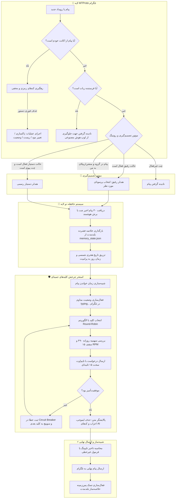

<div align="center" dir="rtl">

# 👻 روح‌گرام پرو (GhostGram PRO)
### *دستیار، رفیق و یوزربات هوشمند و مخفی تلگرام قدرت‌گرفته از هوش مصنوعی*

<p align="center">
  
  
  
  
  
  
  
</p>

<p align="center">
  <a href="#-قابلیت‌های-برجسته"><b>✨ قابلیت‌ها</b></a> •
  <a href="#-راهنمای-کدهای-رمزی-و-مخفی-stealth-codes"><b>🎮 دستورات</b></a> •
  <a href="#-حالت‌های-اصلی-هوش-مصنوعی-و-سیستم-پرسونای-پویا"><b>🎭 پرسونای پویا</b></a> •
  <a href="#-شبیه‌ساز-رفتار-انسانی-human-like-simulation"><b>⚡ رفتار انسانی</b></a> •
  <a href="#-معماری-حافظه-دو-لایه-dual-tier-memory"><b>🧠 حافظه</b></a> •
  <a href="#-راه‌اندازی-و-نصب-سریع"><b>🚀 نصب سریع</b></a> •
  <a href="README.md"><b>🌐 English Version (GhostGram)</b></a>
</p>

---

<p align="center">
  <b>روح‌گرام (GhostGram)</b> یک یوزربات حرفه‌ای، کاملاً نامحسوس (Stealth) و خودکار تلگرام است که حساب کاربری شما را به <b>Google Gemini AI</b> متصل می‌کند.<br/>
  این ربات با زبان و لحن فارسی کاملاً محاوره‌ای چت می‌کند، دارای پرسوناهای متنوع و قابل سوییچ در لحظه است، رفتار خواندن و تایپ کردن انسان را مو‌به‌مو شبیه‌سازی می‌کند، حافظه بلندمدت دارد و با کدهای مخفی ۳ رقمی کنترل می‌شود که به محض ارسال خودبه‌خود پاک می‌شوند.
</p>

---

</div>

<details dir="rtl">
<summary><b>📑 فهرست مطالب (برای باز کردن کلیک کنید)</b></summary>

- [✨ قابلیت‌های برجسته](#-قابلیت‌های-برجسته)
- [🎮 راهنمای کدهای رمزی و مخفی (Stealth Codes)](#-راهنمای-کدهای-رمزی-و-مخفی-stealth-codes)
- [🏗️ معماری و جریان داده سیستم](#️-معماری-و-جریان-داده-سیستم)
- [🎭 حالت‌های اصلی هوش مصنوعی و سیستم پرسونای پویا](#-حالت‌های-اصلی-هوش-مصنوعی-و-سیستم-پرسونای-پویا)
  - [۱. حالت رفیق (Autopilot Alter-Ego)](#۱-حالت-رفیق-autopilot-alter-ego)
  - [۲. حالت دستیار شخصی (Universal Assistant)](#۲-حالت-دستیار-شخصی-universal-assistant)
  - [۳. حالت تعامل خودکار در گروه‌ها (Auto-Engage / Lurker)](#۳-حالت-تعامل-خودکار-در-گروه‌ها-auto-engage--lurker)
  - [۴. سیستم تعویض زنده پرسوناها](#۴-سیستم-تعویض-زنده-پرسوناها)
- [⚡ شبیه‌ساز رفتار انسانی (Human-Like Simulation)](#-شبیه‌ساز-رفتار-انسانی-human-like-simulation)
- [🧬 معماری حافظه دو لایه (Dual-Tier Memory)](#-معماری-حافظه-دو-لایه-dual-tier-memory)
- [🛡️ موتور مدیریت کلیدها و پایداری جمینای (Gemini Engine)](#️-موتور-مدیریت-کلیدها-و-پایداری-جمینای-gemini-engine)
- [🧹 پاکسازی روح (Ghost Purge)](#-پاکسازی-روح-ghost-purge)
- [🚀 راه‌اندازی و نصب سریع](#-راه‌اندازی-و-نصب-سریع)
  - [روش اول: ویزارد نصب آسان و تعاملی (ویندوز)](#روش-اول-ویزارد-نصب-آسان-و-تعاملی-ویندوز)
  - [روش دوم: نصب دستی و محلی (CLI)](#روش-دوم-نصب-دستی-و-محلی-cli)
  - [روش سوم: اجرا با داکر (Docker & Docker Compose)](#روش-سوم-اجرا-با-داکر-docker--docker-compose)
  - [روش چهارم: استقرار ۲۴ ساعته روی سرور لینوکس (VPS Deploy)](#روش-چهارم-استقرار-۲۴-ساعته-روی-سرور-لینوکس-vps-deploy)
- [⚙️ راهنمای تنظیمات محیطی (.env)](#️-راهنمای-تنظیمات-محیطی-env)
- [🔒 امنیت و پکیج‌ساز ایمن گیت‌هاب](#-امنیت-و-پکیج‌ساز-ایمن-گیت‌هاب)
- [📄 لایسنس و سلب مسئولیت](#-لایسنس-و-سلب-مسئولیت)

</details>

---

## ✨ قابلیت‌های برجسته

<div dir="rtl">

<table>
  <tr>
    <td width="50%">
      <h3>🕶️ کدهای مخفی خودحذف‌شونده</h3>
      <p>کنترل کامل ربات از هر چتی با کدهای ۳ رقمی (<code>777</code>، <code>000</code>، <code>666</code>، <code>444</code>، <code>999</code>) که <b>بلافاصله پس از ارسال پاک می‌شوند</b> تا هیچ‌کس متوجه حضور یوزربات نشود.</p>
    </td>
    <td width="50%">
      <h3>🤖 دو حالت اصلی هوش مصنوعی</h3>
      <p>سوییچ آنی میان <b>حالت رفیق</b> (پاسخ با لحن خودمانی شما) و <b>حالت دستیار</b> (منشی رسمی و مودب ۲۴ ساعته برای پاسخگویی به پیوی‌ها و مراجعین).</p>
    </td>
  </tr>
  <tr>
    <td width="50%">
      <h3>🎭 موتور پرسونای نامحدود</h3>
      <p>امکان ساخت فایل‌های متنی دلخواه در پوشه <code>personas/*.txt</code> و تغییر زنده لحن در چت (<code>777 lust</code>، <code>777 sarcastic</code>، <code>777 poetic</code>، <code>777 angry</code>) بدون ریستارت.</p>
    </td>
    <td width="50%">
      <h3>🕵️ تعامل خودکار در گروه‌ها (Lurker)</h3>
      <p>بررسی منظم و پس‌زمینه پیام‌های گروه‌ها بر اساس خروجی ساختاریافته JSON و ورود طبیعی به بحث‌های جذاب در فواصل زمانی تصادفی انسانی.</p>
    </td>
  </tr>
  <tr>
    <td width="50%">
      <h3>⚡ شبیه‌ساز رفتار و تایپ انسانی</h3>
      <p>محاسبه تاخیر خواندن بر اساس تعداد حروف متن + شبیه‌سازی تاخیر تایپ واقعی متناسب با علائم نگارشی فارسی + نمایش مداوم وضعیت <code>typing...</code> و فیلتر کردن کامل ایموجی‌ها.</p>
    </td>
    <td width="50%">
      <h3>🧠 حافظه دو لایه هوشمند</h3>
      <p>نگهداری ۳۰ پیام آخر با برش هوشمند جملات طولانی، به همراه سیستم خلاصه‌ساز پس‌زمینه که فکت‌های کلیدی گفتگو را به طور مداوم ثبت می‌کند.</p>
    </td>
  </tr>
  <tr>
    <td width="50%">
      <h3>🛡️ استخر کلیدهای جمینای (Gemini Pool)</h3>
      <p>چرخش Round-Robin روی نامحدود کلید API، کنترل سقف مصرف روزانه (۴۹۰ درخواست برای هر کلید)، کنترل نرخ ۱۵ درخواست در دقیقه و سیستم قطع مدار (Circuit Breaker).</p>
    </td>
    <td width="50%">
      <h3>🧹 پاکسازی روح (Ghost Purge)</h3>
      <p>حذف فوق‌سریع و دسته‌ای تمامی پیام‌های ارسال شده توسط شما در چت‌ها بدون بر جای گذاشتن ردپا با بازیابی خودکار از خطاهای FloodWait تلگرام.</p>
    </td>
  </tr>
</table>

</div>

---

## 🎮 راهنمای کدهای رمزی و مخفی (Stealth Codes)

> [!IMPORTANT]
> **امنیت اختصاصی مالک**: تمامی کدهای رمزی تنها از طریق پیام‌های ارسالی خود شما (`event.out`) معتبر هستند. همچنین به محض دریافت، **دستور ارسالی شما فوراً حذف می‌شود** تا چت کاملاً طبیعی به نظر برسد.

<div dir="rtl">

```
                  ┌─────────────────────────────────────────────────────────┐
                  │                 نقشه کدهای رمزی روح‌گرام               │
                  └────────────────────────────┬────────────────────────────┘
                                               │
             ┌───────────────────┬─────────────┴─────┬───────────────────┐
             ▼                   ▼                   ▼                   ▼
      [ موتور رفیق ]       [ تعامل گروهی ]     [ دستیار شخصی ]       [ ابزارها و حافظه ]
      • 777 (عادی)        • 777 engage        • 666 (تمام پیوی‌ها)  • 111 (پاسخ هوشمند)
      • 777 <پرسونا>      • 777 engage <دقیقه>• 444 (سکوت این چت)  • 333 (ریست حافظه)
      • 000 (خاموش چت)    • 777 engage off    • 444 all (خاموش کل) • 999 (پاکسازی پیام‌ها)
      • 000 all (خاموش کل)• 777 engage off all                     • 555 (داشبورد وضعیت)
                                                                   • 888 (نمایش راهنما)
```

### 📋 فهرست کامل دستورات و معادل‌های فارسی

| کد مخفی | معادل متنی | محدوده | عملکرد و توضیحات |
| :--- | :--- | :---: | :--- |
| `777` | `!رفیق روشن` | چت جاری | **روشن کردن رفیق** با پرسونای پیش‌فرض (لحن خودمانی و طبیعی). |
| `777 <persona>` | `!حالت <name>` | چت جاری | **روشن کردن رفیق با لحن خاص** (مثلاً `777 lust`، `777 sarcastic`، `777 poetic`). |
| `000` | `!خاموش` | چت جاری | **خاموش کردن رفیق** در این گفتگو. |
| `000 all` | `!خاموش کل` | سراسری | **خاموش کردن رفیق در تمام چت‌ها** به صورت یکجا. |
| `777 engage` | `!پراکنش` | گروه | **فعال‌سازی تعامل خودکار در گروه** (بررسی وضعیت چت هر ۲۰ دقیقه). |
| `777 engage <min>` | - | گروه | **تعامل خودکار با فاصله زمانی دلخواه** (مثلاً `777 engage 35`). |
| `777 engage off` | `!پراکنش خاموش` | گروه | **خاموش کردن تعامل خودکار** در گروه فعلی. |
| `777 engage off all` | - | سراسری | **خاموش کردن تعامل خودکار در تمام گروه‌ها**. |
| `666` | `!دستیار روشن` | کل پیوی‌ها | **روشن کردن دستیار شخصی** برای تمامی مخاطبان فعلی و آینده در پیوی. |
| `444` | `!سکوت` | چت جاری | **توقف دستیار فقط در این چت** (دستیار برای سایر پیوی‌ها روشن می‌ماند). |
| `444 all` | `!دستیار خاموش` | کل پیوی‌ها | **خاموش کردن دستیار در تمام پیوی‌ها**. |
| `111` (روی ریپلای) | `!بگو` | ریپلای | **پاسخ هوشمند**: پاسخ طبیعی به پیامی که ریپلای زده‌اید بر اساس تاریخچه چت. |
| `111 <دستور>` | - | ریپلای | **پاسخ با دستور دلخواه**: (مثلاً `111 بگو فردا بعدازظهر تماس می‌گیرم`). |
| `333` | `!ریست` | چت جاری | **ریست حافظه**: پاکسازی تاریخچه کوتاه‌مدت و خلاصه بلندمدت این چت. |
| `999` | `!پاکسازی` | چت جاری | **پاکسازی روح (کامل)**: حذف آنی تمامی پیام‌های ارسالی شما در این چت. |
| `999 <تعداد>` | `!پاکسازی <تعداد>` | چت جاری | **پاکسازی بخشی از پیام‌ها**: حذف `N` پیام آخر ارسالی شما در این چت. |
| `555` | `!وضعیت` | چت جاری | **وضعیت زنده**: نمایش پنل وضعیت فعلی به مدت ۴ ثانیه و سپس حذف خودکار. |
| `888` | `!راهنما` | چت جاری | **راهنما**: نمایش منوی راهنما و لیست کدهای مخفی. |

</div>

---

## 🏗️ معماری و جریان داده سیستم



---

## 🎭 حالت‌های اصلی هوش مصنوعی و سیستم پرسونای پویا

<div dir="rtl">

### ۱. حالت رفیق (Autopilot Alter-Ego)
با فعال‌سازی کد `777`، ربات درست مثل خود شما رفتار می‌کند؛ سبک چت عامیانه، پاسخ‌های کوتاه و بدون ایموجی و ارجاع دقیق به سوابق گفتگو. در گروه‌ها ربات تنها زمانی پاسخ می‌دهد که کاربری روی شما ریپلای بزند یا نام شما را منشن کند.

### ۲. حالت دستیار شخصی (Universal Assistant)
با ارسال کد `666`، ربات نقش منشی هوشمند و موقر شما را برای تمام پیوی‌ها بر عهده می‌گیرد. به مراجعین پاسخ محترمانه می‌دهد و در صورت تمایل می‌توانید با کد `444` آن را در چت‌های خاصی بی‌صدا کنید.

### ۳. حالت تعامل خودکار در گروه‌ها (Auto-Engage / Lurker)
با دستور `777 engage <دقیقه>`، ربات در گروه‌ها حضور می‌یابد و هر چند دقیقه یک‌بار سوابق را بررسی می‌کند. با استفاده از ساختار داده JSON، در صورتی که بحث جالبی در جریان باشد، هوشمندانه به آن پیام ریپلای می‌زند.

### ۴. سیستم تعویض زنده پرسوناها
کافیست هر فایل متنی با پسوند `.txt` را درون پوشه `personas/` قرار دهید تا بلافاصله به عنوان یک لحن جدید در دسترس باشد:

```
personas/
├── normal.txt          <- لحن عامیانه و پیش‌فرض
├── assistant.txt       <- لحن منشی محترمانه
├── sarcastic.txt       <- لحن طعنه‌زن و تیکه‌دار (`777 sarcastic`)
├── poetic.txt          <- لحن شاعرانه و دراماتیک (`777 poetic`)
├── academic.txt        <- لحن رسمی و علمی (`777 academic`)
├── angry.txt           <- لحن عصبی و رک (`777 angry`)
├── drunk.txt           <- لحن صمیمی و بی‌فیلتر (`777 drunk`)
└── lust.txt            <- لحن محبت‌آمیز و دلنشین (`777 lust`)
```

> [!TIP]
> برای اضافه کردن لحن جدید، کافیست فایلی مثلاً به نام `personas/gamer.txt` بسازید و دستورات مورد نظرتان را درون آن بنویسید. سپس با ارسال `777 gamer` در هر چتی فعال خواهد شد (بدون نیاز به ریستارت ربات!).

</div>

---

## ⚡ شبیه‌ساز رفتار انسانی (Human-Like Simulation)

<div dir="rtl">

روح‌گرام طوری طراحی شده است که تشخیص هوش مصنوعی بودن آن عملاً غیرممکن است:

1. **تاخیر متناسب با خواندن**: قبل از شروع تایپ، مدت زمان خواندن بر اساس تعداد حروف پیام (`40ms` به ازای هر کاراکتر به علاوه تلورانس تصادفی) شبیه‌سازی می‌شود.
2. **وضعیت مداوم `typing...`**: علامت تایپینگ در طول مدت تفکر و تولید متن در بالای چت تلگرام به صورت پیوسته نمایش داده می‌شود.
3. **منحنی غیرخطی سرعت تایپ**: محاسبه سرعت با رابطه `(طول ^ 0.75) * 0.22` همراه با ایجاد مکث‌های طبیعی روی علائم نگارشی فارسی (، . ! ؟) رفتار دست انسان روی کیبورد را شبیه‌سازی می‌کند.
4. **پالایشگر خروجی ضد ربات**: فیلتر کردن تمامی ایموجی‌ها، اعراب‌های عربی، تگ‌های HTML و کاراکترهای اضافی پیش از ارسال به تلگرام.

</div>

---

## 🧬 معماری حافظه دو لایه (Dual-Tier Memory)

<div dir="rtl">

- **حافظه کوتاه‌مدت**: واکشی ۳۰ پیام اخیر گفتگو با ساختار فرستنده، زمان و رشته ریپلای‌ها. پیام‌های خیلی طولانی از انتهای جملات به صورت هوشمند کوتاه می‌شوند.
- **خلاصه‌ساز بلندمدت پس‌زمینه**: هر ۳۰ پیام، روح‌گرام با یک تسک پس‌زمینه ناهمگام در جمینای، مهم‌ترین فکت‌ها و اطلاعات گفتگو را فشرده کرده و در `memory_state.json` ذخیره می‌کند.
- **ریست آنی حافظه (`333`)**: با ارسال این کد، واترمارک زمانی ریست شده و کلیه سوابق کوتاه‌مدت و خلاصه بلندمدت آن چت فوراً پاک می‌شوند.

</div>

---

## 🛡️ موتور مدیریت کلیدها و پایداری جمینای (Gemini Engine)

<div dir="rtl">

- **چرخش خودکار کلیدها (Round-Robin)**: پشتیبانی از تعداد نامحدود کلید جمینای در `apis.txt` یا `.env`.
- **شمارنده سهمیه روزانه**: ثبت میزان مصرف روزانه هر کلید در `api_usage.json` با سقف ایمن ۴۹۰ درخواست در روز (جهت پیشگیری از مسدودسازی اکانت گوگل).
- **محدودکننده نرخ ۱۵ درخواست در دقیقه**: توزیع زمانی هوشمند برای جلوگیری از خطای Rate Limit.
- **سیستم قطع مدار (Circuit Breaker)**: اگر کلیدی ۳ بار پیاپی با خطا مواجه شود، به مدت ۳ ساعت به قرنطینه می‌رود.
- **تایم‌اوت سخت ۱۵ ثانیه‌ای**: در صورت کندی سرورهای گوگل، پردازش پس از ۱۵ ثانیه متوقف شده و کلید بعدی وارد مدار می‌شود.

</div>

---

## 🧹 پاکسازی روح (Ghost Purge)

<div dir="rtl">

با ارسال کد `999`:
- تمامی پیام‌های ارسالی شما در چت شناسایی و در دسته‌های ۵۰ تایی با نهایت سرعت حذف می‌شوند.
- سیستم به طور خودکار خطاهای محدودیت سرعت تلگرام (`FloodWaitError`) را مدیریت می‌کند.
- خود کد `999` پیش از شروع پاکسازی ناپدید می‌شود تا هیچ ردی باقی نماند.

</div>

---

## 🚀 راه‌اندازی و نصب سریع

<div dir="rtl">

### روش اول: ویزارد نصب آسان و تعاملی (ویندوز)
اگر از ویندوز استفاده می‌کنید، کافیست روی فایل **`setup.bat`** دوبار کلیک کنید! دستیار نصب مشخصات تلگرام و جمینای شما را دریافت کرده و فایل `.env` را به صورت خودکار آماده می‌کند:

```powershell
# اجرای ویزارد نصب:
python setup.py
```

---

### روش دوم: نصب دستی و محلی (CLI)

```bash
# ۱. دریافت سورس‌کد
git clone https://github.com/yourusername/ghostgram.git
cd ghostgram

# ۲. ساخت محیط مجازی
python -m venv venv

# ۳. فعال‌سازی محیط مجازی
# در ویندوز:
venv\Scripts\activate
# در لینوکس / مک:
source venv/bin/activate

# ۴. نصب نیازمندی‌ها
pip install -r requirements.txt

# ۵. تنظیم متغیرهای محیطی
cp .env.example .env

# ۶. ورود به تلگرام و ساخت سشن
python login.py

# ۷. اجرای ربات
python main.py
```

---

### روش سوم: اجرا با داکر (Docker & Docker Compose)

```bash
# ساخت و اجرای کانتینر در پس‌زمینه
docker compose up -d --build

# مشاهده لاگ‌های زنده
docker compose logs -f
```

---

### روش چهارم: استقرار ۲۴ ساعته روی سرور لینوکس (VPS Deploy)

پروژه دارای اسکریپت‌های آماده `deploy.bat` و `deploy.sh` است که به صورت خودکار پروژه را بسته‌بندی کرده، روی سرور آپلود نموده و به عنوان یک سرویس پس‌زمینه ۲۴ ساعته تحت `systemd` اجرا می‌کند.

1. در فایل `.env`، مشخصات سرور لینوکس را وارد کنید:
   ```env
   VPS_IP=123.45.67.89
   SSH_USER=root
   SSH_PORT=22
   ```
2. روی فایل **`deploy.bat`** دوبار کلیک کنید.
3. پروژه روی مسیر `/opt/ghostgram` مستقر شده و سرویس `ghostgram.service` فعال می‌گردد.

</div>

---

## ⚙️ راهنمای تنظیمات محیطی (.env)

<div dir="rtl">

```ini
# =================================================================
# 📱 مشخصات تلگرام (از سایت https://my.telegram.org/apps)
# =================================================================
API_ID=12345678
API_HASH=abcdef0123456789abcdef0123456789
PHONE_NUMBER=+989123456789
OWNER_ID=123456789

# =================================================================
# 🧠 کلیدهای هوش مصنوعی جمینای (از https://aistudio.google.com)
# =================================================================
GEMINI_API_KEYS=AIzaSyA...Key1,AIzaSyB...Key2
MODEL_NAME=gemini-3.5-flash-lite
SESSION_NAME=ghostgram_session

# =================================================================
# 🧠 تنظیمات حافظه و رفتار
# =================================================================
SHORT_TERM_MEMORY_LIMIT=30
LONG_TERM_SUMMARY_INTERVAL=30
MAX_LONG_TERM_SUMMARY_CHARS=600
MAX_MESSAGE_SEGMENT_CHARS=200

# =================================================================
# ⌨️ شبیه‌ساز تایپ انسانی
# =================================================================
TYPING_SPEED_CPS=18.0
MIN_TYPING_DELAY=1.5
MAX_TYPING_DELAY=7.0

# =================================================================
# 🚀 تنظیمات دیپلوی روی سرور لینوکس (VPS)
# =================================================================
VPS_IP=your.vps.ip.here
SSH_USER=root
SSH_PORT=22
```

> [!TIP]
> می‌توانید کلیدهای اضافی جمینای خود را خط به خط درون فایل `apis.txt` نیز قرار دهید.

</div>

---

## 🔒 امنیت و پکیج‌ساز ایمن گیت‌هاب

<div dir="rtl">

> [!CAUTION]
> **هرگز فایل‌های `.env`، `apis.txt` یا `*.session` را در گیت‌هاب عمومی آپلود نکنید!**

### استخراج ایمن برای گیت‌هاب (Zero-Leak Exporter)
برای ساخت یک بسته تمیز و فاقد اطلاعات شخصی:

```bat
prepare_github.bat
```

این اسکریپت به صورت خودکار:
- سورس‌کدها، فایل‌های داکر و اسکریپت‌های نصب را جمع‌آوری می‌کند.
- تمام اطلاعات محرمانه (`.env`, `apis.txt`, `*.session`, `teleagent_deploy_config.json`) را حذف می‌کند.
- پرسوناهای شخصی شما را با نمونه تمیز `example.txt` جایگزین می‌کند.
- فایل فشرده `GhostGram_GitHub_Release.zip` را جهت انتشار آماده می‌سازد.

</div>

---

## 📄 لایسنس و سلب مسئولیت

<div dir="rtl">

این پروژه تحت مجوز **MIT License** منتشر شده است.

> [!NOTE]
> **سلب مسئولیت**: این ابزار صرفاً برای مقاصد پژوهشی و اتوماسیون شخصی طراحی شده است. لطفاً مطابق قوانین و شرایط خدمات تلگرام از آن استفاده نمایید.

</div>

---

<div align="center">
طراحی و توسعه یافته با ❤️ برای جامعه متن‌باز.
</div>
